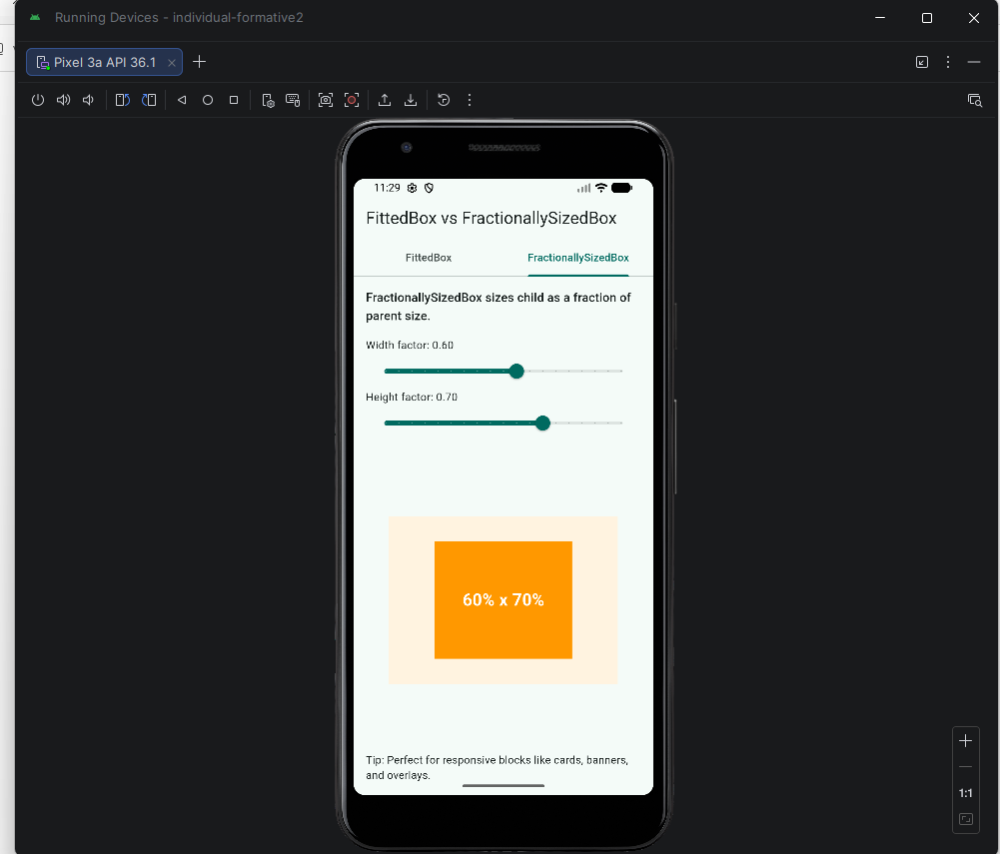

# FittedBox vs FractionallySizedBox Demo

A Flutter presentation app that demonstrates:

- `FittedBox`: how a child scales to fit inside its parent constraints
- `FractionallySizedBox`: how a child takes a width/height fraction of the parent

## Run Steps

1. Install Flutter SDK and confirm `flutter` is available in PATH.
2. Open this project folder in a terminal.
3. Install dependencies:

```bash
flutter pub get
```

4. Run the app:

```bash
flutter run
```

If platform folders are missing in your local copy, initialize first:

```bash
flutter create .
flutter pub get
flutter run
```

## Screenshot

Add your screenshot image to `docs/fractionally-sized-box-demo.png` and keep this reference in the README:



## Attribution Notes

- Code and layout created by project author.
- Screenshot captured from local app run by project author.
- No third-party image assets were used in the demo UI.

## Presentation Flow

1. Open the **FittedBox** tab.
2. Change `BoxFit` mode (`contain`, `cover`, `fitWidth`, `none`) and explain behavior changes.
3. Open the **FractionallySizedBox** tab.
4. Move width/height sliders to show percentage-based responsive sizing.

## Rubric Checklist

- [ ] Repo is public.
- [x] README includes run steps.
- [x] README includes attribution notes.
- [x] README includes screenshot section.
- [ ] Commit history is meaningful (clear, task-focused commits).
- [ ] Project/repo link posted before **5:00 PM**.
